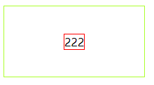

---

layout: post

title: '元素居中的N种方式'

date: 2020-11-1

author: feiYu

color: rgb(255,210,32)

cover: '../assets/css.png'

tags: Css

subtitle: " "

---


### 元素居中的N种方式

#### 1、水平垂直居中

> 需已知子元素宽高，也可以使用transform：translate（-50%, -50%）,无需知道子元素宽高

```css
.parent{
    position: relative;
    width: 400px;
    height: 200px;
    border: 1px greenyellow solid;
}
.child{
    position: absolute;
    width: 200px;
    height: 100px;
    left: 50%;
    top: 50%;
    margin-left: -100px;
    margin-top: -50px;
}
```

#### 2、水平垂直居中

```css
.parent{
    position: relative;
    width: 400px;
    height: 200px;
    border: 1px greenyellow solid;
}
.child{
    position: absolute;
    width: 200px;
    height: 100px;
    left: 0;
    top: 0;
    right: 0;
    bottom: 0;
    margin: auto;
    border: 1px solid red;
}
```


#### 2、块级元素水平居中

```css
.child{
    width: 200px;
    height: 100px;
    margin: 0 auto;
    border: 1px solid red;
}
```

#### 3、内联元素水平居中

```css
.parent{
    position: relative;
    text-align: center;
    border: 1px greenyellow solid;
}
.child{
	display: inline-block;
    width: 200px;
    height: 100px;
    border: 1px solid red;
}
```

#### 4、flex

> 无需知道子元素宽高。但兼容性不好。

```css
.parent{
    display: flex;
    width: 200px;
    height: 100px;
    justify-content: center;
    align-items: center;
    border: 1px greenyellow solid;
}
.child{
    border: 1px solid red;
}
```

#### 5、grid布局

> 兼容性较差

```css
.parent{
    display: grid;
    width: 200px;
    height: 100px;
    border: 1px greenyellow solid;
}
.child{
    justify-self: center;
    align-self: center;
    border: 1px solid red;
}
```



